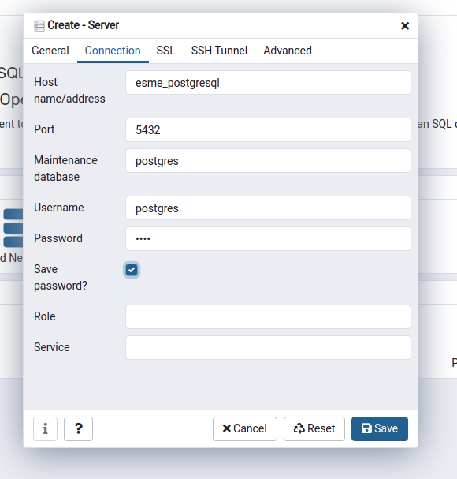

This repository contains scripts to create a virtual machine that exposes databases we use
during classes:

* sportsdb
* pizza_shop
* transtats (you have to continue the installation with [Flywaydb-Transtats](https://github.com/Esme-Sudria-Database/Flywaydb-Transtats))
* bio_icare_drone
* bloon_project


Requirement 1 : installation to perform on your computer
========================================================

You will need those softwares on your computer :

* [Virtual box](https://www.virtualbox.org/)
* [Vagrant](https://www.vagrantup.com/)
* [Git](https://git-scm.com/)

On linux
---------

```
sudo apt-get install git
```

I recommand to setup the last version of vagrant and virtualbox from their website

* [Vagrant](https://www.vagrantup.com/)
* [Virtual box](https://www.virtualbox.org/)

On windows
-----------

Download and install the 3 softwares above.

On mac
-------

```
brew install git
```

Install by hand :

* [Vagrant](https://www.vagrantup.com/)
* [Virtual box](https://www.virtualbox.org/)

Step 1 : install the environment
================================

1. clone this repository :

```
git clone https://github.com/Esme-Sudria-Database/lab-postgresql.git
```

To create the virtual machine, use the command

    cd lab-postgresql
    vagrant up

This script will use image from ubuntu 18.04. Ansible will pull and run containers with postgresql and pgadmin, then load
the sample databases.

Step 2 : configure pgadmin to use postgresql
============================================

1. connect on http://192.168.33.10 with your browser


Here is the logging information to use :

* Utilisateur : user
* Mot de passe : user

[pgadmin](https://www.pgadmin.org/) is a GUI client for postgresql.

2. declare your postgresql database in pgadmin


2.1. write the display name in pgadmin


2.2. configure the server connection



Host Name : postgres
login : user
password: user

the Host Name is resolved through [user-defined-network on docker](https://docs.docker.com/v17.09/engine/userguide/networking/configure-dns/).

Step 3: use the database that match our practical work

Architecture
============

[To complete]

Troubleshooting
===============

[To complete]

Check ansible playbook
=======================

    make tests
